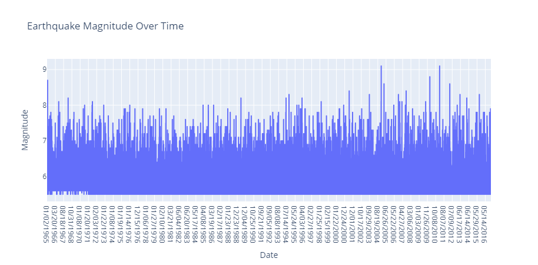
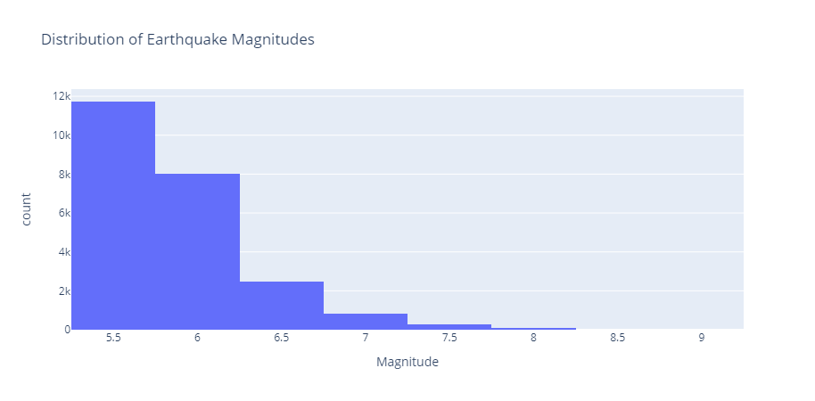
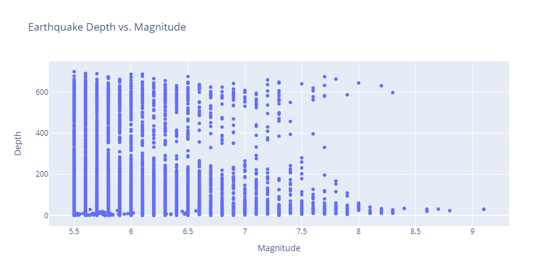
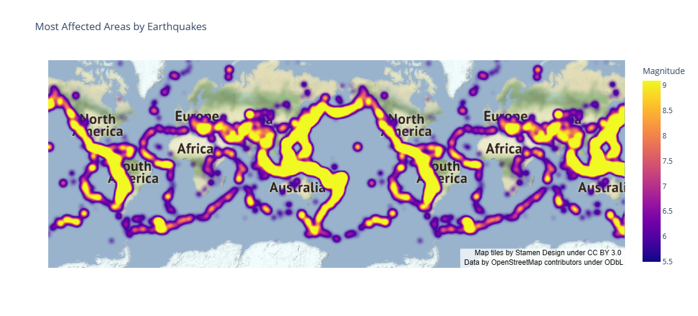

# Introduction:

This project develops an artificial intelligence model to predict the magnitude and depth of earthquakes based on the location and time of occurrence. A machine learning approach utilizing neural networks is employed for modelling. The network architectures are designed, trained, and evaluated for accuracy using regression metrics. Visualizations of earthquake data provide further insights into the model's performance.

# Installations:

To run this code, you need to have Python 3 installed along with the following libraries:

- Pandas
- Matplotlib
- Keras
- Sklearn
- Plotly

You can install these libraries using pip or any other package manager for python. For example, to install Pandas, you can use the following command in your terminal:

```
pip install pandas
```

Similarly, you can install other libraries by replacing pandas with the name of the library you want to install.

# Data:

The data represents a collection of earthquake events that occurred between January 1965 and December 2016. Each row represents a single earthquake event and contains information such as the date and time of the event, the latitude and longitude of the earthquake's epicenter, the type of earthquake, its depth, magnitude, and other seismic parameters.

The columns in the data are:

- Date: The date of the earthquake event in mm/dd/yyyy format.
- Time: The time of the earthquake event in hh:mm:ss format.
- Latitude: The latitude of the earthquake's epicenter in decimal degrees.
- Longitude: The longitude of the earthquake's epicenter in decimal degrees.
- Type: The type of earthquake, such as "Earthquake" or "Nuclear Explosion".
- Depth: The depth of the earthquake's focus in kilometers.
- Depth Error: The estimated standard error of the reported depth.
- Depth Seismic Stations: The number of seismic stations used to calculate the reported depth.
- Magnitude: The magnitude of the earthquake on the Richter scale.
- Magnitude Type: The type of magnitude reported, such as ML, MS, or MW.
- Magnitude Error: The estimated standard error of the reported magnitude.
- Magnitude Seismic Stations: The number of seismic stations used to calculate the reported magnitude.
- Azimuthal Gap: The azimuthal gap in degrees, which measures the range of azimuths over which the seismic waves were measured.
- Horizontal Distance: The horizontal distance from the epicenter to the nearest station in degrees of arc.
- Horizontal Error: The estimated standard error of the reported horizontal distance.
- Root Mean Square: The root mean square error of the waveform fitting.
- ID: The identification code of the earthquake event.
- Source: The source of the earthquake data.
- Location Source: The source of the location data.
- Magnitude Source: The source of the magnitude data.
- Status: The status of the event (automatic or reviewed)

# Usage:

To use this code, you need to first download the "database.csv" file and save it in the same directory as the Python script. You can then run the code in a Python environment such as Jupyter Notebook or Spyder.

The code reads the earthquake data from the "database.csv" file and processes it to create a final dataset with time in seconds, latitude, longitude, depth, and magnitude columns. It then uses this dataset to train a machine learning model to predict the depth and magnitude of an earthquake based on its time, latitude, and longitude.

The code also provides visualizations of earthquake data using various Plotly charts such as scatter maps, time series line charts, histograms, and scatter plots. These charts provide insights into the distribution of earthquake magnitudes, depth, and locations.

To predict the depth and magnitude of an earthquake, you can use the "Predictions" section of the code. You need to provide the current timestamp, latitude, and longitude of the earthquake, and the code will use the trained machine learning model to predict its depth and magnitude.

# Data Preprocessing:

This section preprocesses the dataset by:

- Selecting relevant columns from the dataset  
- Converting date and time columns to Unix timestamp 
- Dropping the original date and time columns
- Checking for invalid timestamps
- Scaling the data using StandardScaler()

# Model:

An artificial neural network is designed and implemented using Keras. The network consists of two hidden layers of 64 and 32 nodes respectively utilizing ReLU activation. The model is trained for 50 epochs with a batch size of 32 using mean squared error loss and the Adam optimizer.

# Training and Evaluation

The data is split into train and test sets using an 80/20 ratio. Feature scaling is performed using StandardScaler. The model’s accuracy is evaluated using metrics like mean absolute error, root mean squared error and mean absolute percentage error. A confusion matrix is also generated.

# Regression Metrics:

This section calculates various regression metrics to evaluate the model performance, including:

- Accuracy
- Precision
- Recall 
- F1 score
- MAE
- RMSE
- MAPE
- Confusion matrix

# Visualizations:

Various visualizations are created to gain insights into the model and data:

- Mapbox scatter plot of earthquake locations

- Line chart of magnitudes over time

- Histogram of magnitude distribution

- Scatter plot of magnitude vs depth 
 
- Mapbox plot of earthquake counts by location

- Density map of affected areas


# Conclusion:

The model provides a reasonable initial capability to predict earthquake magnitudes and depths based on location and time. The visualizations highlight its performance in different regions and limitations that could be addressed through enhancements:

- Incorporating more features like soil type, tectonic plate movement, etc
- Using advanced deep learning models and training on larger datasets
- Tuning hyperparameters for improved accuracy
- Performing error analysis to identify and improve model deficiencies